# Open Hours Flows

## Calendar View

#### Flow ID: CAL-100

**Flow Name:** Admin sees all bookings for staff and services

**Type:** Business

1. **Goal**
   Admin views the calendar of booked appointments across staff and services.

2. **Actors**
   * Admin
   * OpenHours System

3. **Preconditions**
   * Admin is signed in.
   * Staff, services, customers, and bookings may exist.

4. **Postconditions**
   * **Success:** Calendar shows bookings for the selected week with staff, service, customer, and time details.
   * **Failure:** Calendar stays available, but booking data is not shown and an error or empty state is displayed.

5. **Main Path**
   1. Admin opens the calendar view.
   2. OpenHours System loads bookings for the current week.
   3. OpenHours System shows each booking with staff, service, customer, and time details.
   4. Admin reviews booked appointments for the week.

6. **Alternate Paths**
   * No bookings exist: OpenHours System shows an empty calendar state.
   * Booking data cannot load: OpenHours System shows an error and keeps Admin on the calendar view.

7. **Comments**
   * This flow depends on staff, service, and customer records being meaningful to display.

8. **Mermaid Sequence Diagram**
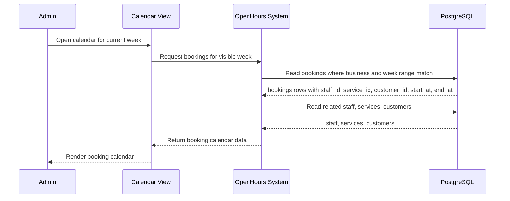

---

#### Flow ID: CAL-200

**Flow Name:** Admin switches the week to see bookings in another week

**Type:** Business

1. **Goal**
   Admin navigates the calendar to review bookings outside the currently selected week.

2. **Actors**
   * Admin
   * OpenHours System

3. **Preconditions**
   * Admin is signed in.
   * Admin is viewing the calendar.

4. **Postconditions**
   * **Success:** Calendar shows bookings for the newly selected week.
   * **Failure:** Calendar remains on a usable view and reports that bookings could not be loaded.

5. **Main Path**
   1. Admin selects a previous, next, or current-week calendar control.
   2. OpenHours System updates the visible week range.
   3. OpenHours System loads bookings for the selected week.
   4. Admin sees appointments for the selected week.

6. **Alternate Paths**
   * Selected week has no bookings: OpenHours System shows an empty week.
   * Booking data cannot load: OpenHours System shows an error for the selected week.

7. **Comments**
   * Week switching only changes the visible date range; it does not modify bookings.

8. **Mermaid Sequence Diagram**
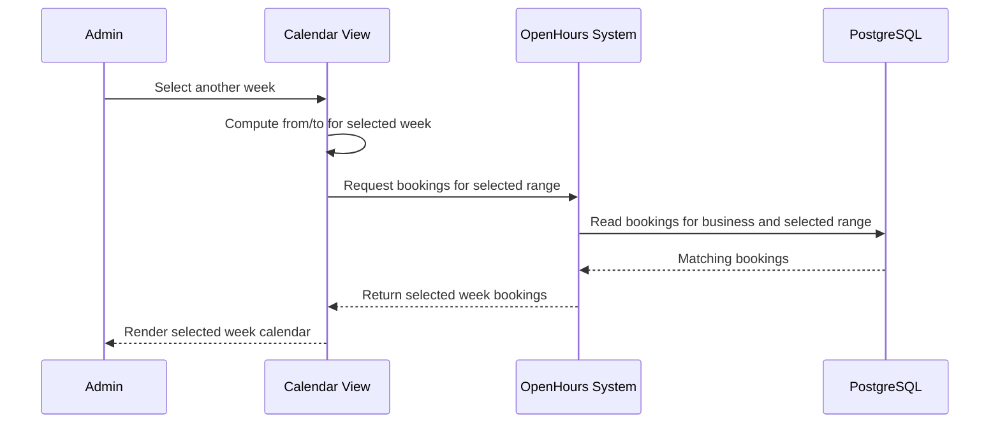

---

#### Flow ID: CAL-300

**Flow Name:** Admin filters bookings by staff and service

**Type:** Business

1. **Goal**
   Admin narrows the calendar to bookings for selected staff and services.

2. **Actors**
   * Admin
   * OpenHours System

3. **Preconditions**
   * Admin is viewing the calendar.
   * Staff and services exist.

4. **Postconditions**
   * **Success:** Calendar shows only bookings that match the selected filters.
   * **Failure:** Calendar remains visible and either shows an empty filtered state or reports a loading issue.

5. **Main Path**
   1. Admin selects staff or service filters.
   2. OpenHours System applies the selected filters to the current week.
   3. OpenHours System shows only matching bookings.
   4. Admin reviews the filtered booking set.

6. **Alternate Paths**
   * No matching bookings exist: OpenHours System shows an empty filtered state.
   * Filters are cleared: OpenHours System returns to the unfiltered calendar view.

7. **Comments**
   * Filtering helps Admin focus on a specific staff member, service, or staffing/service combination.

8. **Mermaid Sequence Diagram**
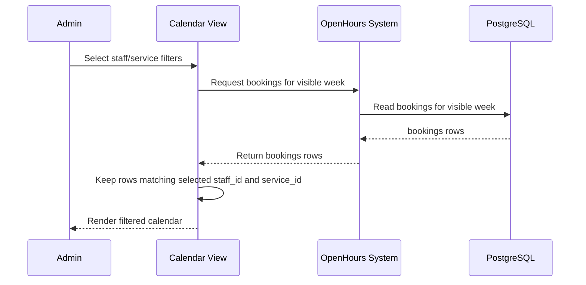

---

#### Flow ID: CAL-400

**Flow Name:** Admin books an appointment for a customer with a service and staff

**Type:** Business

1. **Goal**
   Admin creates an appointment for a customer using a selected staff member and service.

2. **Actors**
   * Admin
   * OpenHours System

3. **Preconditions**
   * Admin is signed in.
   * Selected staff, service, and customer exist.
   * Selected time can be evaluated against availability.

4. **Postconditions**
   * **Success:** Booking is created and appears in the calendar.
   * **Failure:** Booking is not created and Admin receives guidance to correct the selection.

5. **Main Path**
   1. Admin chooses a customer, service, staff member, and appointment time.
   2. OpenHours System checks whether the selected slot is valid for the staff and service.
   3. Admin confirms the booking.
   4. OpenHours System creates the appointment.
   5. OpenHours System refreshes the calendar so the new booking appears.

6. **Alternate Paths**
   * Slot is outside open hours: OpenHours System prevents booking and asks Admin to choose another time.
   * Slot conflicts with another booking: OpenHours System rejects the booking.
   * Required selection is missing: OpenHours System keeps the booking form open until the missing value is provided.

7. **Comments**
   * This flow uses resolved open hours to determine whether a staff/service slot can be booked.

8. **Mermaid Sequence Diagram**
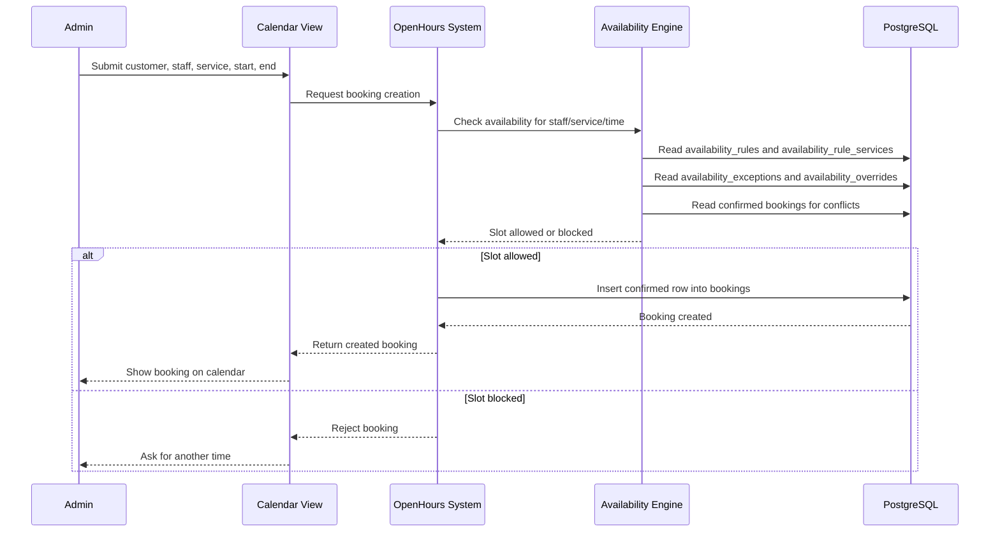

---

## Viewing & Resolution

#### Flow ID: OHV-100

**Flow Name:** Admin views staff open-hours dashboard

**Type:** Business

1. **Goal**
   Admin reviews staff open-hour windows in the admin dashboard.

2. **Actors**
   * Admin
   * OpenHours System

3. **Preconditions**
   * Admin is signed in.
   * Staff exists.

4. **Postconditions**
   * **Success:** Dashboard shows resolved open-hour windows for staff in the visible week.
   * **Failure:** Dashboard remains visible but shows an empty state or loading error.

5. **Main Path**
   1. Admin opens the open-hours dashboard.
   2. OpenHours System loads active staff.
   3. OpenHours System resolves each staff member's open-hour windows for the visible week after removing deleted occurrences and applying individual occurrence edits.
   4. OpenHours System renders the resolved windows in the weekly grid with the services that apply to each open hour.
   5. Admin reviews which staff are open for which services and times.

6. **Alternate Paths**
   * No staff exists: OpenHours System shows guidance to add staff before creating open hours.
   * No open hours exist: OpenHours System shows an empty weekly grid for the staff.
   * Windows cannot load: OpenHours System keeps the dashboard visible and reports the loading issue.

7. **Comments**
   * This dashboard is the admin entry point for creating, editing, and deleting open hours.
   * The dashboard view should reflect exceptions and overrides, not just the base recurrence rules.

8. **Mermaid Sequence Diagram**
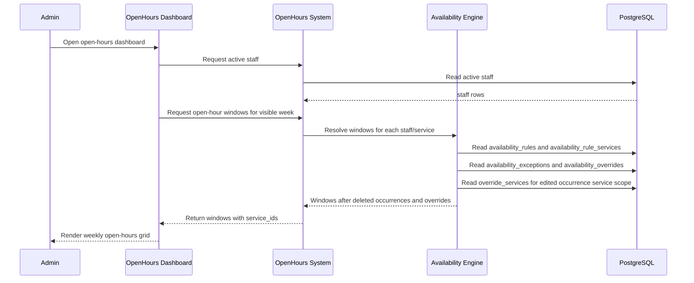

---

#### Flow ID: OHR-100

**Flow Name:** OpenHours dashboard resolves all the staff open-hour windows

**Type:** Runtime

1. **Goal**
   OpenHours System produces the open-hour windows shown in dashboard and booking experiences.

2. **Actors**
   * OpenHours System

3. **Preconditions**
   * A staff member and date range are selected.
   * Open-hour rules may include recurrence, deleted occurrences, and individual occurrence edits.

4. **Postconditions**
   * **Success:** A sorted list of concrete open-hour windows is returned.
   * **Failure:** No windows are returned for invalid or unavailable source data.

5. **Main Path**
   1. OpenHours System finds active open-hour rules for the staff, services, and date range.
   2. OpenHours System expands each rule into concrete occurrence windows.
   3. OpenHours System removes deleted single occurrences.
   4. OpenHours System replaces base occurrences with individual occurrence edits.
   5. OpenHours System merges windows across services for dashboard display.
   6. OpenHours System returns windows with context needed to edit or delete the correct occurrence.

6. **Alternate Paths**
   * A rule cannot be expanded: OpenHours System skips the invalid rule and continues resolving remaining windows.
   * An edited occurrence applies only to selected services: OpenHours System shows the edited window only for those services.
   * No windows match the range: OpenHours System returns an empty list.

7. **Comments**
   * Resolution is the shared behavior behind admin viewing, admin booking checks, and client booking availability.

8. **Mermaid Sequence Diagram**
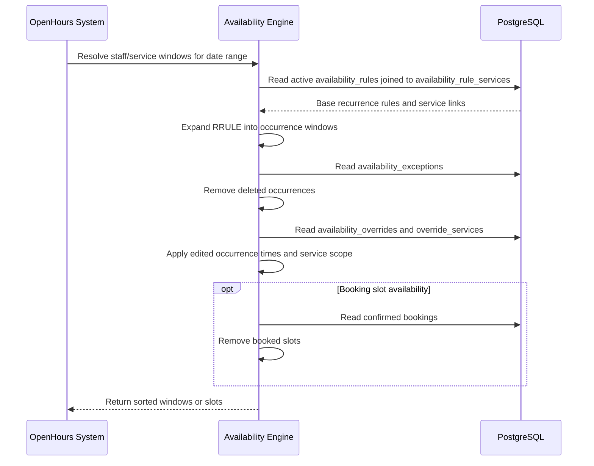

---

## Creating Open Hours

#### Flow ID: OHC-100

**Flow Name:** Admin creates weekly staff open hours

**Type:** Business

1. **Goal**
   Admin creates a repeating weekly schedule for a staff member.

2. **Actors**
   * Admin
   * OpenHours System

3. **Preconditions**
   * Admin is signed in.
   * Staff and services exist.

4. **Postconditions**
   * **Success:** Weekly open-hour rules exist for enabled slots, and only changed weekly slots are processed when editing an existing weekly schedule.
   * **Failure:** No weekly open hours are created.

5. **Main Path**
   1. Admin clicks the plus sign to open the schedule form and selects a staff member.
   2. Admin chooses the Weekly Schedule option.
   3. OpenHours System loads existing weekly open hours for the selected staff into the weekly editor.
   4. Admin reviews the existing repeating weekly open hours.
   5. Admin enables one or more weekdays, enters one or more time slots, or changes existing weekly slots.
   6. Admin chooses which services each slot supports.
   7. OpenHours System saves only the weekly slots that were added, changed, or removed.
   8. OpenHours System refreshes the dashboard with the updated weekly windows.

6. **Alternate Paths**
   * No staff is selected: OpenHours System prevents saving until Admin selects a staff member.
   * No services are selected for a slot: OpenHours System treats the slot as available for all active services.
   * A weekday is disabled: OpenHours System does not create an open-hour rule for that day.
   * Admin appends a new weekly slot: OpenHours System creates only the new slot and leaves existing weekly slots unchanged.
   * Admin deletes an existing weekly slot: OpenHours System removes only that slot and leaves the other weekly slots unchanged.

7. **Comments**
   * Weekly schedule creation is optimized for staff with predictable week-to-week availability.
   * Reopening the weekly schedule is also an edit experience because it shows existing weekly open hours before Admin saves changes.

8. **Mermaid Sequence Diagram**
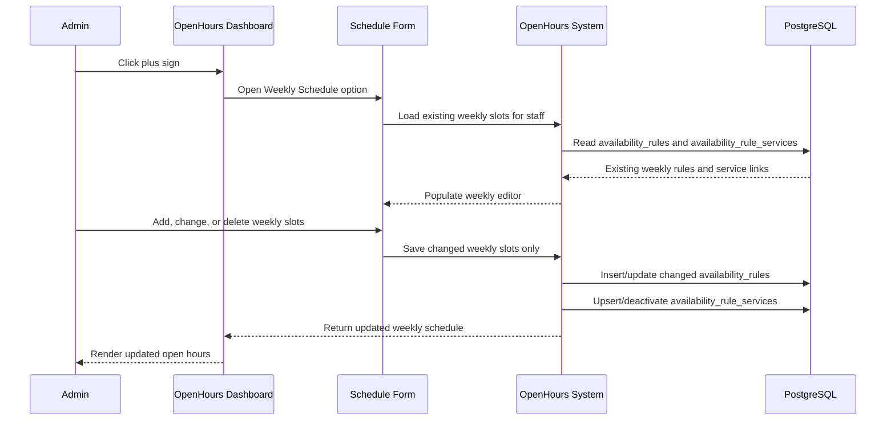

---

#### Flow ID: OHC-200

**Flow Name:** Admin creates daily recurring staff open hours

**Type:** Business

1. **Goal**
   Admin creates open hours that repeat every day.

2. **Actors**
   * Admin
   * OpenHours System

3. **Preconditions**
   * Admin is signed in.
   * Staff and services exist.

4. **Postconditions**
   * **Success:** A daily recurring open-hour rule exists.
   * **Failure:** No daily recurring rule is created.

5. **Main Path**
   1. Admin clicks the plus sign to open the schedule form and selects a staff member.
   2. Admin chooses the Custom Schedule form.
   3. Admin enters the start and end time for the open-hour window.
   4. Admin chooses the daily recurrence option.
   5. Admin chooses services for the window.
   6. OpenHours System saves a daily recurring open-hour rule.
   7. OpenHours System refreshes the dashboard with the daily windows.

6. **Alternate Paths**
   * Admin does not choose an end condition: OpenHours System treats the daily recurrence as ongoing.
   * End time is invalid for the selected start: OpenHours System prevents saving until the time range is corrected.

7. **Comments**
   * Daily recurrence is the base flow; selected-date and occurrence-count endings are separate edge flows.

8. **Mermaid Sequence Diagram**
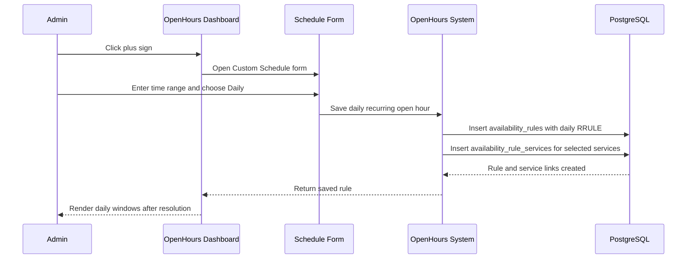

---

#### Flow ID: OHC-210

**Flow Name:** Admin creates daily recurring staff open hours that end on a selected date

**Type:** Business

1. **Goal**
   Admin creates daily open hours that stop on a specific date.

2. **Actors**
   * Admin
   * OpenHours System

3. **Preconditions**
   * Admin is creating a daily recurring open-hour rule.

4. **Postconditions**
   * **Success:** Daily open hours repeat through the selected end date.
   * **Failure:** Daily open hours are not created with an invalid or missing end date.

5. **Main Path**
   1. Admin clicks the plus sign to open the schedule form and selects a staff member.
   2. Admin chooses the Custom Schedule form.
   3. Admin enters the open-hour date and time range.
   4. Admin chooses the daily recurrence option.
   5. Admin selects the "ends on" option.
   6. Admin chooses the final recurrence date.
   7. OpenHours System saves the daily rule with an effective end date.
   8. OpenHours System shows daily windows only through the selected date.

6. **Alternate Paths**
   * End date is missing: OpenHours System prevents saving until Admin selects a date.
   * End date is before the first occurrence: OpenHours System rejects the invalid recurrence range.

7. **Comments**
   * This case documents explicit end-date behavior for daily recurrence only, to avoid duplicating similar flows for every recurrence type.

8. **Mermaid Sequence Diagram**
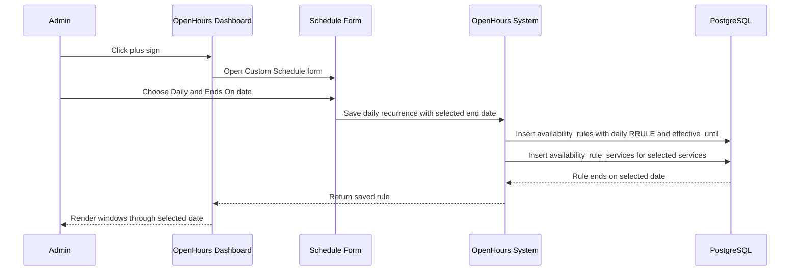

---

#### Flow ID: OHC-220

**Flow Name:** Admin creates daily recurring staff open hours that end after a number of occurrences

**Type:** Business

1. **Goal**
   Admin creates daily open hours that stop after a fixed number of occurrences.

2. **Actors**
   * Admin
   * OpenHours System

3. **Preconditions**
   * Admin is creating a daily recurring open-hour rule.

4. **Postconditions**
   * **Success:** Daily open hours repeat for the requested number of occurrences.
   * **Failure:** Daily open hours are not created with an invalid occurrence count.

5. **Main Path**
   1. Admin clicks the plus sign to open the schedule form and selects a staff member.
   2. Admin chooses the Custom Schedule form.
   3. Admin enters the open-hour date and time range.
   4. Admin chooses the daily recurrence option.
   5. Admin selects the "ends after" option.
   6. Admin enters the number of occurrences.
   7. OpenHours System saves the daily rule with an occurrence limit.
   8. OpenHours System shows only the requested number of daily windows.

6. **Alternate Paths**
   * Occurrence count is missing or below one: OpenHours System prevents saving until Admin enters a valid count.
   * Occurrence count is above the supported limit: OpenHours System caps or rejects the count according to product limits.

7. **Comments**
   * This case documents occurrence-count behavior for daily recurrence only, to avoid duplicating similar flows for every recurrence type.

8. **Mermaid Sequence Diagram**
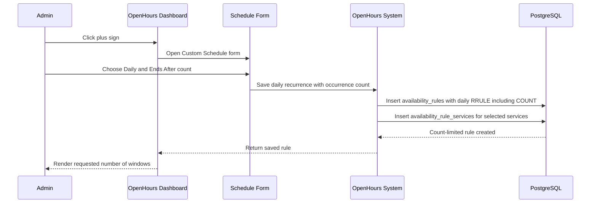

---

#### Flow ID: OHC-300

**Flow Name:** Admin creates weekday recurring staff open hours

**Type:** Business

1. **Goal**
   Admin creates open hours that repeat Monday through Friday.

2. **Actors**
   * Admin
   * OpenHours System

3. **Preconditions**
   * Admin is signed in.
   * Staff and services exist.

4. **Postconditions**
   * **Success:** A weekday recurring open-hour rule exists.
   * **Failure:** No weekday recurring rule is created.

5. **Main Path**
   1. Admin clicks the plus sign to open the schedule form and selects a staff member.
   2. Admin chooses the Custom Schedule form.
   3. Admin enters the start and end time.
   4. Admin chooses the weekday recurrence option.
   5. Admin chooses services for the window.
   6. OpenHours System saves a weekday recurring open-hour rule.
   7. OpenHours System refreshes the dashboard with Monday through Friday windows.

6. **Alternate Paths**
   * Weekend dates are visible: OpenHours System does not show this rule on Saturday or Sunday.
   * No services are selected: OpenHours System treats the rule as available for all active services.

7. **Comments**
   * Weekday recurrence is represented as a weekly recurrence across Monday through Friday.

8. **Mermaid Sequence Diagram**
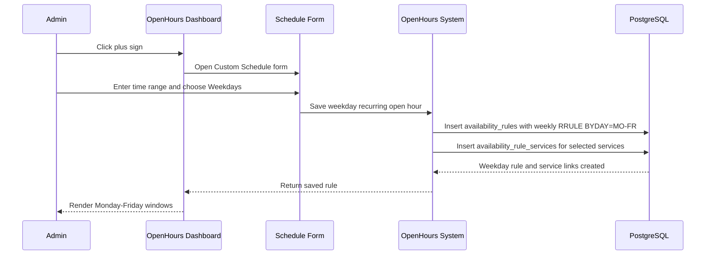

---

#### Flow ID: OHC-400

**Flow Name:** Admin creates monthly recurring staff open hours

**Type:** Business

1. **Goal**
   Admin creates open hours that repeat monthly on the selected date pattern.

2. **Actors**
   * Admin
   * OpenHours System

3. **Preconditions**
   * Admin is signed in.
   * Staff and services exist.

4. **Postconditions**
   * **Success:** A monthly recurring open-hour rule exists.
   * **Failure:** No monthly recurring rule is created.

5. **Main Path**
   1. Admin clicks the plus sign to open the schedule form and selects a staff member.
   2. Admin chooses the Custom Schedule form.
   3. Admin enters the start date, start time, end date, and end time.
   4. Admin chooses the monthly recurrence option.
   5. Admin chooses services for the window.
   6. OpenHours System saves a monthly recurring open-hour rule.
   7. OpenHours System refreshes the dashboard with matching monthly windows.

6. **Alternate Paths**
   * Selected month does not contain the recurrence day: OpenHours System follows the recurrence engine's monthly occurrence behavior.
   * Time range is invalid: OpenHours System prevents saving until Admin corrects the range.

7. **Comments**
   * Monthly recurrence can produce sparse results in a weekly dashboard because occurrences may not fall in the visible week.

8. **Mermaid Sequence Diagram**
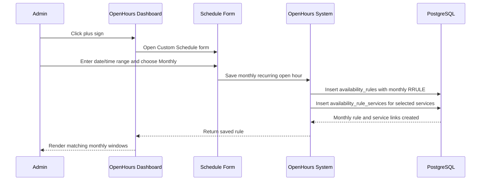

---

#### Flow ID: OHC-500

**Flow Name:** Admin creates non-repeating staff open hour

**Type:** Business

1. **Goal**
   Admin creates a one-time open-hour window for a staff member.

2. **Actors**
   * Admin
   * OpenHours System

3. **Preconditions**
   * Admin is signed in.
   * Staff and services exist.

4. **Postconditions**
   * **Success:** A one-time open-hour window exists for the selected date and time.
   * **Failure:** No one-time open hour is created.

5. **Main Path**
   1. Admin clicks the plus sign to open the schedule form and selects a staff member.
   2. Admin chooses the Custom Schedule form.
   3. Admin enters a start date/time and end date/time.
   4. Admin chooses the non-repeating recurrence option.
   5. Admin chooses services for the window.
   6. OpenHours System saves a one-time open-hour rule.
   7. OpenHours System shows the window only on the selected occurrence.

6. **Alternate Paths**
   * Selected date is outside the visible week: OpenHours System saves the rule and shows it when Admin views the matching week.
   * Time range is invalid: OpenHours System prevents saving until Admin corrects the range.

7. **Comments**
   * Non-repeating open hours are represented as a recurrence with a single occurrence.

8. **Mermaid Sequence Diagram**
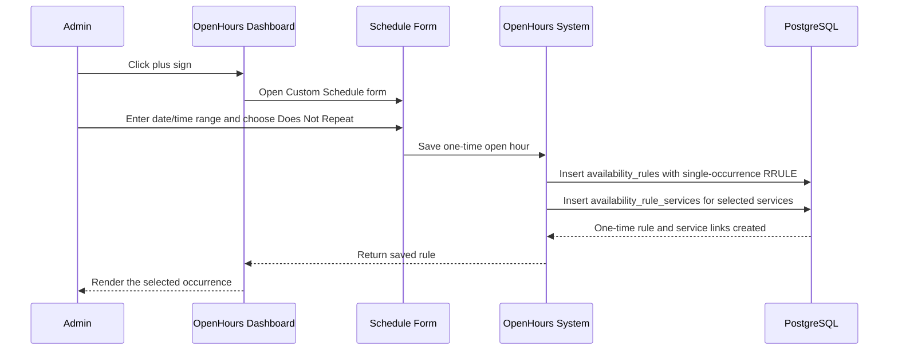

---

#### Flow ID: OHC-600

**Flow Name:** Admin creates custom recurring staff open hours

**Type:** Business

1. **Goal**
   Admin creates a custom recurrence pattern for staff open hours.

2. **Actors**
   * Admin
   * OpenHours System

3. **Preconditions**
   * Admin is signed in.
   * Staff and services exist.

4. **Postconditions**
   * **Success:** A custom recurring open-hour rule exists.
   * **Failure:** No custom recurring rule is created.

5. **Main Path**
   1. Admin clicks the plus sign to open the schedule form and selects a staff member.
   2. Admin enters the open-hour time range.
   3. Admin opens custom recurrence settings.
   4. Admin chooses frequency, interval, repeat days when applicable, and an optional end condition.
   5. OpenHours System saves the custom recurring open-hour rule.
   6. OpenHours System refreshes the dashboard with windows that match the custom pattern.

6. **Alternate Paths**
   * Custom recurrence is incomplete: OpenHours System keeps the recurrence editor open until required values are provided.
   * No end condition is selected: OpenHours System treats the custom recurrence as ongoing.

7. **Comments**
   * Custom recurrence is the escape hatch for recurrence patterns not covered by the preset options.

8. **Mermaid Sequence Diagram**
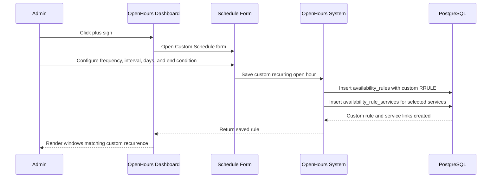

---

## Editing Open Hours

#### Flow ID: OHE-100

**Flow Name:** Admin edits a single occurrence for the first time

**Type:** Business

1. **Goal**
   Admin changes one occurrence without changing the rest of the recurrence series.

2. **Actors**
   * Admin
   * OpenHours System

3. **Preconditions**
   * Admin is viewing an existing recurring open-hour occurrence.

4. **Postconditions**
   * **Success:** A single occurrence edit exists and the base series remains unchanged.
   * **Failure:** No occurrence edit is created.

5. **Main Path**
   1. Admin opens an occurrence from the open-hours dashboard.
   2. Admin chooses to edit only this event.
   3. Admin changes the time range or service selection.
   4. OpenHours System creates an individual occurrence edit for the original occurrence.
   5. OpenHours System keeps the rest of the series unchanged.
   6. OpenHours System refreshes the dashboard with the edited occurrence.

6. **Alternate Paths**
   * Occurrence context is missing: OpenHours System prevents the single-occurrence edit.
   * Edited time range is invalid: OpenHours System rejects the change and keeps the edit form open.

7. **Comments**
   * Individual edits are tied to the original occurrence so later dashboard actions can target the same occurrence.

8. **Mermaid Sequence Diagram**
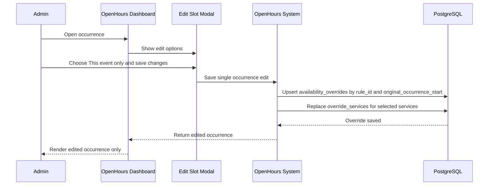

---

#### Flow ID: OHE-200

**Flow Name:** Admin edits a single occurrence that was already edited earlier

**Type:** Business

1. **Goal**
   Admin changes a previously edited occurrence again without creating duplicate occurrence edits.

2. **Actors**
   * Admin
   * OpenHours System

3. **Preconditions**
   * Admin is viewing an occurrence that already has an individual edit.

4. **Postconditions**
   * **Success:** Existing occurrence edit is updated.
   * **Failure:** Existing occurrence edit remains unchanged.

5. **Main Path**
   1. Admin opens the previously edited occurrence.
   2. Admin chooses to edit only this event.
   3. Admin changes the time range or service selection.
   4. OpenHours System updates the existing individual occurrence edit.
   5. OpenHours System keeps the rest of the series unchanged.
   6. OpenHours System refreshes the dashboard with the latest occurrence values.

6. **Alternate Paths**
   * Previous edit no longer applies to selected services: OpenHours System updates the service scope for that occurrence.
   * Occurrence context is missing: OpenHours System prevents the edit.

7. **Comments**
   * This is an update to a previous individual modification, not a second parallel modification.

8. **Mermaid Sequence Diagram**
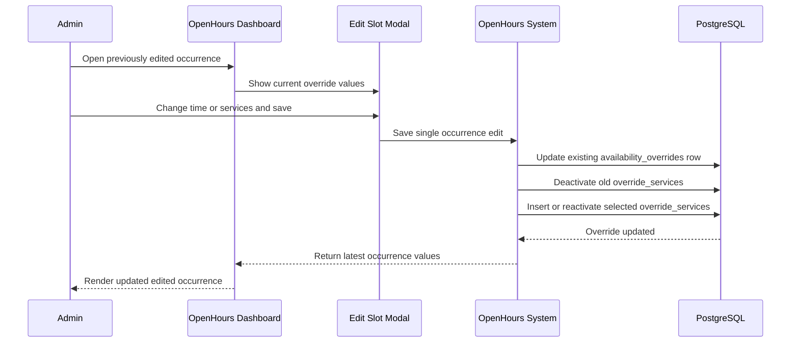

---

#### Flow ID: OHE-300

**Flow Name:** Admin edits this and following occurrences and does not reset individual modifications

**Type:** Business

1. **Goal**
   Admin changes the selected occurrence and future occurrences while preserving future individual edits.

2. **Actors**
   * Admin
   * OpenHours System

3. **Preconditions**
   * Admin is viewing an occurrence in a recurring series.

4. **Postconditions**
   * **Success:** Series is split and future individual modifications are preserved where applicable.
   * **Failure:** Existing series remains unchanged.

5. **Main Path**
   1. Admin opens an occurrence from the recurring series.
   2. Admin chooses to edit this and following events.
   3. Admin leaves reset individual modifications disabled.
   4. OpenHours System ends the old series before the selected occurrence.
   5. OpenHours System creates a new series beginning at the selected occurrence with the updated values.
   6. OpenHours System carries future individual edits into the new series where they still apply.

6. **Alternate Paths**
   * Selected occurrence is the first occurrence: OpenHours System treats the change as an entire-series edit.
   * Future individual edits conflict after the split: OpenHours System keeps one valid edit per affected occurrence.

7. **Comments**
   * This flow preserves future modifications, so the admin's existing per-occurrence adjustments are not lost.

8. **Mermaid Sequence Diagram**
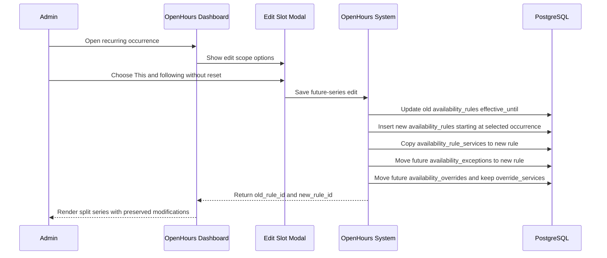

---

#### Flow ID: OHE-400

**Flow Name:** Admin edits this and following occurrences and accepts resetting individual modifications

**Type:** Business

1. **Goal**
   Admin changes the selected and future occurrences while removing future individual edits.

2. **Actors**
   * Admin
   * OpenHours System

3. **Preconditions**
   * Admin is viewing an occurrence in a recurring series.

4. **Postconditions**
   * **Success:** Series is split and future individual modifications are removed.
   * **Failure:** Existing series and modifications remain unchanged.

5. **Main Path**
   1. Admin opens an occurrence from the recurring series.
   2. Admin chooses to edit this and following events.
   3. Admin enables reset individual modifications.
   4. OpenHours System ends the old series before the selected occurrence.
   5. OpenHours System removes future individual edits from the original series.
   6. OpenHours System creates a new future series using the updated values.

6. **Alternate Paths**
   * No future individual edits exist: OpenHours System still splits the series and applies the new future values.
   * Selected occurrence is the first occurrence: OpenHours System treats the change as an entire-series edit with reset behavior.

7. **Comments**
   * Resetting individual modifications intentionally discards future one-off edits and deletions from the selected occurrence onward.

8. **Mermaid Sequence Diagram**
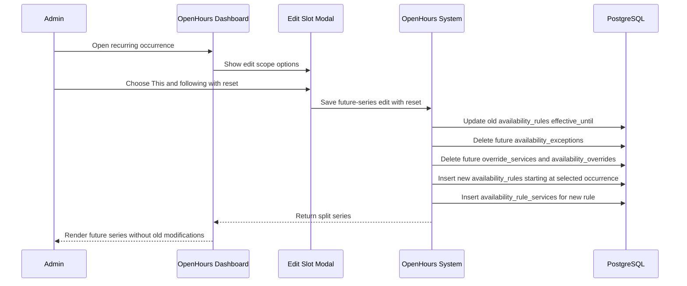

---

#### Flow ID: OHE-500

**Flow Name:** Admin chooses this and following but on the first occurrence of the recurrence series

**Type:** Business

1. **Goal**
   OpenHours System handles a first-occurrence future edit as an entire-series edit.

2. **Actors**
   * Admin
   * OpenHours System

3. **Preconditions**
   * Admin is editing the first occurrence of a recurring series.

4. **Postconditions**
   * **Success:** Series is updated without creating a redundant split.
   * **Failure:** Series remains unchanged.

5. **Main Path**
   1. Admin chooses to edit this and following events.
   2. OpenHours System detects that the selected occurrence is the first occurrence in the series.
   3. OpenHours System avoids creating a redundant split.
   4. OpenHours System applies the change using entire-series edit behavior.
   5. OpenHours System refreshes the dashboard with the updated series.

6. **Alternate Paths**
   * Admin requested reset individual modifications: OpenHours System applies reset behavior while updating the whole series.
   * First occurrence cannot be identified: OpenHours System rejects the edit instead of creating an invalid split.

7. **Comments**
   * This edge case prevents a split where the old series would have no valid occurrences before the split point.

8. **Mermaid Sequence Diagram**
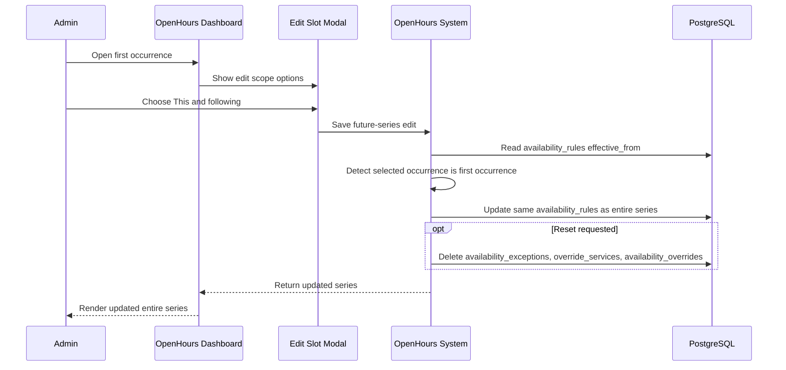

---

#### Flow ID: OHE-600

**Flow Name:** Admin edits the entire series and does not reset individual modifications

**Type:** Business

1. **Goal**
   Admin changes the recurring series while preserving individual edits where possible.

2. **Actors**
   * Admin
   * OpenHours System

3. **Preconditions**
   * Admin is viewing an occurrence from a recurring series.

4. **Postconditions**
   * **Success:** Series is updated and individual modifications are preserved where possible.
   * **Failure:** Existing series and modifications remain unchanged.

5. **Main Path**
   1. Admin chooses to edit all events in the series.
   2. Admin leaves reset individual modifications disabled.
   3. Admin changes the series time, recurrence, services, or capacity.
   4. OpenHours System updates the existing series.
   5. OpenHours System re-aligns individual edits to the updated series timing when needed.
   6. OpenHours System refreshes the dashboard with the updated series and preserved edits.

6. **Alternate Paths**
   * Series timing does not change: OpenHours System keeps individual edits attached to their existing occurrence keys.
   * An individual edit conflicts after re-alignment: OpenHours System keeps one valid edit for the affected occurrence.

7. **Comments**
   * This flow is used when the admin wants the base series to change without losing previous one-off decisions.

8. **Mermaid Sequence Diagram**
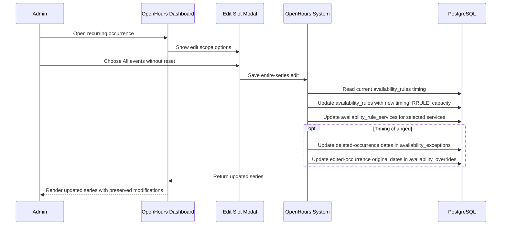

---

#### Flow ID: OHE-700

**Flow Name:** Admin edits the entire series and accepts resetting individual modifications

**Type:** Business

1. **Goal**
   Admin changes the recurring series and removes all individual occurrence edits.

2. **Actors**
   * Admin
   * OpenHours System

3. **Preconditions**
   * Admin is viewing an occurrence from a recurring series.

4. **Postconditions**
   * **Success:** Series is updated and all individual modifications are removed.
   * **Failure:** Existing series and modifications remain unchanged.

5. **Main Path**
   1. Admin chooses to edit all events in the series.
   2. Admin enables reset individual modifications.
   3. Admin changes the series time, recurrence, services, or capacity.
   4. OpenHours System removes individual edits and deleted-occurrence markers for the series.
   5. OpenHours System updates the series with the new values.
   6. OpenHours System refreshes the dashboard with only the updated base series.

6. **Alternate Paths**
   * No individual modifications exist: OpenHours System updates the series normally.
   * Series update fails: OpenHours System leaves the existing series and modifications unchanged.

7. **Comments**
   * This flow is used when Admin wants the edited series to fully replace earlier individual occurrence decisions.

8. **Mermaid Sequence Diagram**
```mermaid
sequenceDiagram
  participant Admin
  participant Dashboard as OpenHours Dashboard
  participant Modal as Edit Slot Modal
  participant System as OpenHours System
  participant DB as PostgreSQL
  Admin->>Dashboard: Open recurring occurrence
  Dashboard->>Modal: Show edit scope options
  Admin->>Modal: Choose All events with reset
  Modal->>System: Save entire-series edit with reset
  System->>DB: Delete availability_exceptions for rule
  System->>DB: Delete override_services and availability_overrides for rule
  System->>DB: Update availability_rules with new timing, RRULE, capacity
  System->>DB: Update availability_rule_services for selected services
  System-->>Dashboard: Return updated base series
  Dashboard-->>Admin: Render updated series without individual modifications
```

---

## Deleting Open Hours

#### Flow ID: OHD-100

**Flow Name:** Admin deletes a single occurrence which is not edited before

**Type:** Business

1. **Goal**
   Admin removes one occurrence without deleting the rest of the series.

2. **Actors**
   * Admin
   * OpenHours System

3. **Preconditions**
   * Admin is viewing an existing recurring occurrence.

4. **Postconditions**
   * **Success:** Selected occurrence is removed and the rest of the series remains active.
   * **Failure:** No occurrence is removed.

5. **Main Path**
   1. Admin opens the occurrence from the dashboard.
   2. Admin chooses to delete this event only.
   3. OpenHours System records the selected occurrence as deleted.
   4. OpenHours System leaves the rest of the recurring series active.
   5. OpenHours System refreshes the dashboard without the deleted occurrence.

6. **Alternate Paths**
   * Occurrence context is missing: OpenHours System prevents the single-occurrence deletion.
   * Occurrence was already deleted: OpenHours System keeps the deletion idempotent.

7. **Comments**
   * Deleting one occurrence is represented as an exception against the recurrence series.

8. **Mermaid Sequence Diagram**
```mermaid
sequenceDiagram
  participant Admin
  participant Dashboard as OpenHours Dashboard
  participant Modal as Delete Modal
  participant System as OpenHours System
  participant DB as PostgreSQL
  Admin->>Dashboard: Open occurrence
  Dashboard->>Modal: Show delete scope options
  Admin->>Modal: Choose This event only
  Modal->>System: Delete single occurrence
  System->>DB: Delete any override_services for this occurrence
  System->>DB: Delete any availability_overrides for this occurrence
  System->>DB: Upsert availability_exceptions with reason deleted
  System-->>Dashboard: Return deletion result
  Dashboard-->>Admin: Remove occurrence from grid
```

---

#### Flow ID: OHD-200

**Flow Name:** Admin deletes a single occurrence that was already edited earlier

**Type:** Business

1. **Goal**
   Admin removes a previously edited occurrence from the series.

2. **Actors**
   * Admin
   * OpenHours System

3. **Preconditions**
   * Admin is viewing an occurrence that already has an individual edit.

4. **Postconditions**
   * **Success:** Previous edit is removed and the occurrence is deleted.
   * **Failure:** Previous edit and occurrence remain unchanged.

5. **Main Path**
   1. Admin opens the previously edited occurrence.
   2. Admin chooses to delete this event only.
   3. OpenHours System removes the individual edit for that occurrence.
   4. OpenHours System records the occurrence as deleted.
   5. OpenHours System refreshes the dashboard without the occurrence.

6. **Alternate Paths**
   * Edited occurrence has scoped services: OpenHours System removes the edit and service scope before applying the deletion.
   * Occurrence context is missing: OpenHours System prevents the deletion.

7. **Comments**
   * This flow ensures an edited occurrence does not continue to appear after Admin deletes it.

8. **Mermaid Sequence Diagram**
```mermaid
sequenceDiagram
  participant Admin
  participant Dashboard as OpenHours Dashboard
  participant Modal as Delete Modal
  participant System as OpenHours System
  participant DB as PostgreSQL
  Admin->>Dashboard: Open previously edited occurrence
  Dashboard->>Modal: Show delete scope options
  Admin->>Modal: Choose This event only
  Modal->>System: Delete edited single occurrence
  System->>DB: Delete override_services for occurrence override
  System->>DB: Delete availability_overrides for occurrence
  System->>DB: Upsert availability_exceptions with reason deleted
  System-->>Dashboard: Return deletion result
  Dashboard-->>Admin: Remove edited occurrence from grid
```

---

#### Flow ID: OHD-300

**Flow Name:** Admin deletes this and following occurrences

**Type:** Business

1. **Goal**
   Admin removes the selected occurrence and all future occurrences from a series.

2. **Actors**
   * Admin
   * OpenHours System

3. **Preconditions**
   * Admin is viewing an occurrence in a recurring series.

4. **Postconditions**
   * **Success:** Series ends before the selected occurrence and future modifications are removed.
   * **Failure:** Series remains unchanged.

5. **Main Path**
   1. Admin opens the occurrence from the dashboard.
   2. Admin chooses to delete this and following events.
   3. OpenHours System ends the series before the selected occurrence.
   4. OpenHours System removes future deleted-occurrence markers and individual edits that no longer apply.
   5. OpenHours System refreshes the dashboard without the selected and future occurrences.

6. **Alternate Paths**
   * Selected occurrence is the first occurrence: OpenHours System treats the action as deleting the entire series.
   * No future modifications exist: OpenHours System only truncates the base series.

7. **Comments**
   * This flow preserves past occurrences and removes availability from the selected occurrence onward.

8. **Mermaid Sequence Diagram**
```mermaid
sequenceDiagram
  participant Admin
  participant Dashboard as OpenHours Dashboard
  participant Modal as Delete Modal
  participant System as OpenHours System
  participant DB as PostgreSQL
  Admin->>Dashboard: Open recurring occurrence
  Dashboard->>Modal: Show delete scope options
  Admin->>Modal: Choose This and following
  Modal->>System: Delete selected and future occurrences
  System->>DB: Read availability_rules effective_from
  alt Selected occurrence is not first
    System->>DB: Update availability_rules effective_until to day before selected occurrence
    System->>DB: Delete future availability_exceptions
    System->>DB: Delete future override_services and availability_overrides
    System-->>Dashboard: Return truncated series
  else Selected occurrence is first
    System->>DB: Mark availability_rules inactive
    System->>DB: Clean up exceptions, overrides, and service links
    System-->>Dashboard: Return entire-series deletion
  end
  Dashboard-->>Admin: Remove selected and future windows
```

---

#### Flow ID: OHD-400

**Flow Name:** Admin chooses delete this and following on the first occurrence

**Type:** Business

1. **Goal**
   OpenHours System safely handles a first-occurrence future deletion as a full-series deletion.

2. **Actors**
   * Admin
   * OpenHours System

3. **Preconditions**
   * Admin is deleting the first occurrence of a recurring series.

4. **Postconditions**
   * **Success:** Entire series is deleted without creating an invalid truncated series.
   * **Failure:** Series remains unchanged.

5. **Main Path**
   1. Admin chooses to delete this and following events.
   2. OpenHours System detects that the selected occurrence is the first occurrence.
   3. OpenHours System avoids creating an invalid truncated series.
   4. OpenHours System deletes the entire series.
   5. OpenHours System refreshes the dashboard without the series.

6. **Alternate Paths**
   * First occurrence cannot be identified: OpenHours System rejects the deletion instead of truncating incorrectly.
   * Series cleanup fails: OpenHours System leaves the series visible and reports the failure.

7. **Comments**
   * This edge case prevents an effective-until date before the series start.

8. **Mermaid Sequence Diagram**
```mermaid
sequenceDiagram
  participant Admin
  participant Dashboard as OpenHours Dashboard
  participant Modal as Delete Modal
  participant System as OpenHours System
  participant DB as PostgreSQL
  Admin->>Dashboard: Open first occurrence
  Dashboard->>Modal: Show delete scope options
  Admin->>Modal: Choose This and following
  Modal->>System: Delete selected and future occurrences
  System->>DB: Read availability_rules effective_from
  System->>System: Detect selected occurrence is first occurrence
  System->>DB: Mark availability_rules inactive
  System->>DB: Delete override_services and availability_overrides
  System->>DB: Delete availability_exceptions
  System->>DB: Deactivate availability_rule_services
  System-->>Dashboard: Return entire-series deletion
  Dashboard-->>Admin: Remove series from grid
```

---

#### Flow ID: OHD-500

**Flow Name:** Admin deletes the entire series

**Type:** Business

1. **Goal**
   Admin removes a complete recurring open-hour series.

2. **Actors**
   * Admin
   * OpenHours System

3. **Preconditions**
   * Admin is viewing an occurrence from a recurring series.

4. **Postconditions**
   * **Success:** Series and its related individual modifications no longer appear in open hours.
   * **Failure:** Series remains active and visible.

5. **Main Path**
   1. Admin opens an occurrence from the series.
   2. Admin chooses to delete all events in the series.
   3. OpenHours System marks the series inactive.
   4. OpenHours System removes related individual edits, deleted-occurrence markers, and service associations.
   5. OpenHours System refreshes the dashboard without the series.

6. **Alternate Paths**
   * Series is already inactive: OpenHours System keeps the delete operation idempotent.
   * Cleanup fails: OpenHours System reports the failure and avoids showing a partially deleted result.

7. **Comments**
   * Entire-series deletion removes the base recurrence and its occurrence-level modifications.

8. **Mermaid Sequence Diagram**
```mermaid
sequenceDiagram
  participant Admin
  participant Dashboard as OpenHours Dashboard
  participant Modal as Delete Modal
  participant System as OpenHours System
  participant DB as PostgreSQL
  Admin->>Dashboard: Open recurring occurrence
  Dashboard->>Modal: Show delete scope options
  Admin->>Modal: Choose All events in series
  Modal->>System: Delete entire series
  System->>DB: Mark availability_rules inactive
  System->>DB: Delete override_services and availability_overrides
  System->>DB: Delete availability_exceptions
  System->>DB: Deactivate availability_rule_services
  System-->>Dashboard: Return deletion result
  Dashboard-->>Admin: Remove series from grid
```

---

## Client Side Booking

#### Flow ID: CLB-100

**Flow Name:** Client sees what services are available for booking

**Type:** Business

1. **Goal**
   Client discovers which services can be booked.

2. **Actors**
   * Client
   * OpenHours System

3. **Preconditions**
   * Public booking access is available.
   * Active services may exist.

4. **Postconditions**
   * **Success:** Client can choose a service and continue toward booking.
   * **Failure:** Client cannot select a service and sees an empty state or error.

5. **Main Path**
   1. Client opens the booking experience.
   2. OpenHours System loads active services available for booking.
   3. Client reviews service options.
   4. Client selects the service they want to book.
   5. OpenHours System uses the selected service to guide staff and time availability choices.

6. **Alternate Paths**
   * No services are available: OpenHours System shows an empty booking state.
   * Service list cannot load: OpenHours System shows an error and asks Client to retry.

7. **Comments**
   * Available services are the entry point into the public booking flow.

8. **Mermaid Sequence Diagram**
```mermaid
sequenceDiagram
  participant Client
  participant Page as Booking Page
  participant System as OpenHours System
  participant DB as PostgreSQL
  Client->>Page: Open booking experience
  Page->>System: Request active services
  System->>DB: Read active services
  DB-->>System: services rows
  System-->>Page: Return bookable services
  Page-->>Client: Show service choices
  Client->>Page: Select service
  Page->>System: Request staff for selected service
  System->>DB: Read staff via staff_services or open-hour service links
  DB-->>System: Matching staff
  System-->>Page: Return available staff choices
  Page-->>Client: Continue to staff and time selection
```

---

#### Flow ID: CLB-200

**Flow Name:** Client books an appointment

**Type:** Business

1. **Goal**
   Client reserves an available appointment slot.

2. **Actors**
   * Client
   * OpenHours System

3. **Preconditions**
   * Client has selected a bookable service.
   * At least one staff member has availability for the selected service.

4. **Postconditions**
   * **Success:** Appointment is created and confirmed to Client.
   * **Failure:** Appointment is not created and Client receives guidance to retry or select another slot.

5. **Main Path**
   1. Client chooses a service, staff member, and available time slot.
   2. Client enters required contact details.
   3. OpenHours System verifies that the selected slot is still available.
   4. OpenHours System creates the booking.
   5. OpenHours System confirms the appointment to Client.

6. **Alternate Paths**
   * Slot is no longer available: OpenHours System rejects the booking and asks Client to choose another slot.
   * Required customer details are missing: OpenHours System keeps the booking form open until Client completes required fields.
   * Availability cannot be confirmed: OpenHours System does not create the booking and asks Client to retry.

7. **Comments**
   * Booking confirmation depends on current availability at the moment Client submits the booking.

8. **Mermaid Sequence Diagram**
```mermaid
sequenceDiagram
  participant Client
  participant Page as Booking Page
  participant System as OpenHours System
  participant Engine as Availability Engine
  participant DB as PostgreSQL
  Client->>Page: Submit service, staff, slot, and contact details
  Page->>System: Request booking creation
  System->>DB: Find or create customer in customers
  System->>Engine: Verify selected staff/service slot
  Engine->>DB: Read availability_rules and availability_rule_services
  Engine->>DB: Read availability_exceptions and availability_overrides
  Engine->>DB: Read confirmed bookings for conflicts
  Engine-->>System: Slot allowed or blocked
  alt Slot allowed
    System->>DB: Insert confirmed row into bookings
    DB-->>System: Booking created
    System-->>Page: Return booking confirmation
    Page-->>Client: Show appointment confirmation
  else Slot blocked
    System-->>Page: Reject booking
    Page-->>Client: Ask Client to choose another slot
  end
```

---

## Availability Engine

#### Flow ID: AVE-100

**Flow Name:** Availability engine resolves the open-hour windows shown to Admin in the dashboard week grid

**Type:** Runtime

1. **Goal**
   Show Admin the correct open-hour windows for a staff member in the selected dashboard week.

2. **Actors**
   * Admin
   * OpenHours Dashboard
   * OpenHours System
   * Availability Engine

3. **Preconditions**
   * Admin is viewing the open-hours dashboard.
   * A staff member and week are selected.
   * Staff may have regular repeating open hours.
   * Some open-hour occurrences may have been deleted or edited earlier.
   * Services may be attached to the staff open hours.

4. **Postconditions**
   * **Success:** OpenHours Dashboard shows the correct open-hour blocks with the services that apply to each block.
   * **Failure:** OpenHours Dashboard shows an empty state or error instead of showing incorrect open hours.

5. **Main Path**
   1. Admin opens the open-hours dashboard for a week.
   2. OpenHours Dashboard asks the system for that staff member's open hours for the visible week.
   3. OpenHours System finds the staff member's active open-hour rules and the services connected to them.
   4. Availability Engine turns repeating rules into the actual occurrences that fall inside the visible week.
   5. Availability Engine removes occurrences that Admin deleted earlier.
   6. Availability Engine replaces occurrences that Admin edited earlier with the edited time and service selection.
   7. Availability Engine also includes edited occurrences that still apply to a service even if the base rule was changed later.
   8. OpenHours System groups the same rule occurrence across services into one dashboard block and collects the services that apply to that occurrence.
   9. If another rule has the same time, OpenHours System keeps it as a separate dashboard block so edit/delete actions still target the correct rule.
   10. OpenHours Dashboard renders the final windows in the week grid.

6. **Alternate Paths**
   * Staff or week cannot be loaded: OpenHours Dashboard shows an error and does not render stale data.
   * No open hours exist for the selected week: OpenHours Dashboard shows an empty week.
   * A service has no open hours in the week: OpenHours System skips that service and continues with the remaining services.
   * An occurrence was deleted earlier: Availability Engine leaves that occurrence out of the dashboard.
   * An occurrence was edited earlier: Availability Engine shows the edited version instead of the original occurrence.

7. **Comments**
   * Admin dashboard windows are open-hour windows, not bookable appointment slots.
   * The dashboard is meant to show when staff are open and which services they can provide during those open hours.
   * Client booking availability is handled separately because clients need actual bookable time slots, not broad open-hour blocks.
   * The system keeps enough occurrence information behind the scenes so later edit/delete actions can still target the correct occurrence.

8. **Mermaid Sequence Diagram**
```mermaid
sequenceDiagram
  participant Admin
  participant Dashboard as OpenHours Dashboard
  participant System as OpenHours System
  participant Engine as Availability Engine
  participant DB as PostgreSQL
  Admin->>Dashboard: View open-hours week
  Dashboard->>System: GET admin merged windows with staff_id, from, to, time_zone
  System->>System: Validate staff_id/from/to and load time_zone
  System->>DB: Read active services for the business
  DB-->>System: services rows
  System->>DB: Preload availability_overrides and override_services for staff/range
  DB-->>System: Override service scopes
  loop For each service
    System->>Engine: GetResolvedWindows(staff_id, service_id, from, to)
    Engine->>DB: Read active availability_rules joined to availability_rule_services
    Engine->>Engine: Expand RRULE using timezone and local start/end
    Engine->>DB: Read availability_exceptions by rule/range
    Engine->>Engine: Remove deleted occurrences
    Engine->>DB: Read availability_overrides and override_services
    Engine->>Engine: Apply edited times and service scope
    Engine-->>System: Resolved windows with rule_id and occurrence_start
  end
  System->>System: Group same rule occurrence by rule_id, occurrence_start, start, end
  System->>System: Collect service_ids and keep different rules separate even with same time
  System-->>Dashboard: Return sorted dashboard windows
  Dashboard-->>Admin: Render staff open hours
```

---

#### Flow ID: AVE-200

**Flow Name:** Availability engine resolves client bookable slots

**Type:** Runtime

1. **Goal**
   Show Client the appointment times they can actually book for the selected staff member and service.

2. **Actors**
   * Client
   * Booking Page
   * OpenHours System
   * Availability Engine

3. **Preconditions**
   * Client has selected a service and staff member.
   * Client is looking at a date range in the booking experience.
   * Staff may have regular open hours or edited individual occurrences for the selected service.
   * Some times may already be booked by other appointments.

4. **Postconditions**
   * **Success:** Booking Page shows only the appointment slots that Client can book.
   * **Failure:** Booking Page shows an empty state or error instead of offering unavailable times.

5. **Main Path**
   1. Client selects staff, service, date range, and duration on the Booking Page.
   2. Booking Page asks OpenHours System for available appointment times.
   3. OpenHours System asks Availability Engine to calculate the times that match the selected staff and service.
   4. Availability Engine starts from the staff member's open-hour rules for that service.
   5. Availability Engine turns repeating rules into real open windows inside the requested date range.
   6. Availability Engine removes deleted occurrences and uses edited occurrences where Admin changed a single open hour earlier.
   7. Availability Engine reads windows that come purely from overrides even if the rule no longer lists the selected service in `availability_rule_services`.
   8. Availability Engine splits the remaining open windows into appointment-sized slots.
   9. Availability Engine removes slots that overlap already confirmed bookings.
   10. Availability Engine returns the final sorted list of bookable slots to the Booking Page.
   11. Booking Page shows those slots to Client.

6. **Alternate Paths**
   * Staff, service, or date range cannot be loaded: Booking Page shows an error and does not show stale slots.
   * No open hours match the selected service: Booking Page shows no available times.
   * All matching open hours are already booked: Booking Page shows no available times.
   * An edited occurrence applies to a different service: Availability Engine does not show that edited time for the selected service.

7. **Comments**
   * Client-side availability returns bookable slots, not the broader dashboard open-hour windows.
   * Client-side availability starts from staff open hours, then narrows them down to appointment times.
   * Confirmed bookings are removed before the slots are shown to Client.
   * This flow is stricter than the admin dashboard because Client should only see times they can actually book.

8. **Mermaid Sequence Diagram**
```mermaid
sequenceDiagram
  participant Client
  participant Page as Booking Page
  participant System as OpenHours System
  participant Engine as Availability Engine
  participant DB as PostgreSQL
  Client->>Page: Select staff, service, date range, duration
  Page->>System: GET public availability with staff_id, service_id, from, to, duration_minutes
  System->>System: Validate IDs/range and parse duration
  System->>Engine: GetAvailability(staff_id, service_id, range, duration, capacity 1)
  Engine->>DB: Read active availability_rules linked by availability_rule_services
  Engine->>Engine: Expand RRULEs into open windows
  Engine->>DB: Read availability_exceptions by rule/range
  Engine->>DB: Read availability_overrides and override_services
  Engine->>Engine: Apply deletes, edited times, and service scope
  Engine->>DB: Read override-only windows where main recurrence does not include this service
  Engine->>Engine: Split windows into duration-sized slots
  Engine->>DB: Read confirmed bookings for staff/range
  Engine->>Engine: Remove overlapping booked slots and de-duplicate
  Engine-->>System: Return available slots and count
  System-->>Page: Return public availability response
  Page-->>Client: Show bookable slots
```
